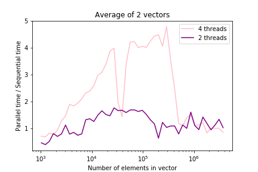
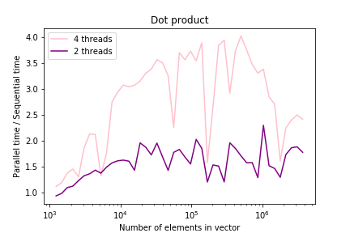
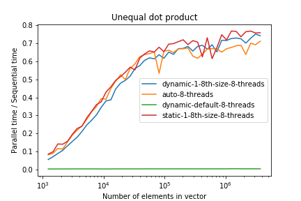
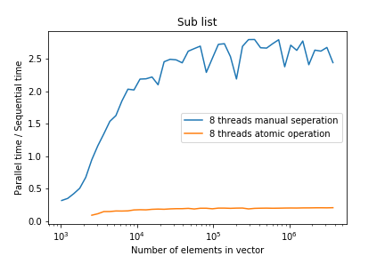

## Programmation Parallèle TP 2 - OpenMP

### Goal :

Using OpenMP to parallelize programs using the multiple threads available on a cpu. The cpu that's used for the following results is a `1,6 GHz Intel Core i5` that contains 2 threads. Some programs are also run with a `3.6 GHz Intel Core i7` that contains 8 threads.

#### Setup & Useful code

**Makefile flags**: We would need `-fopenmp` to run OpenMP.

Add `#include <omp.h>` to use openmp directive.

To parallise a block of code add :

```C
#pragma omp parallel
{
    // Code that runs within a thread
}
```

We can find

- Total number of threads with `omp_get_num_thread()`.
- Current thread number with `omp_get_thread_num`.

We can add a clause to the `#pragma omp parallel` to indicate how the memory should be shared, such as :

- `default`
  define the default memory behaviour
- `private`
  The specified variable is local within each thread
- `shared`
  The specified variable is global and shared with each thread

To directly parallise a for loop :

```C
#pragma omp parallel for
for(int i = 0; i < length; i++)
{
    // code
}
```

We can add clause to `#pragma omp parallel for schedule(CLAUSE)`

- `static <size of block>`
  Each thread is allocated the size of block iterations in a round robin fashion.

- `dynamic <size of block optional, default 1>`
  Each thread executes a chunk of iterations then requests another chunk until none remain.
  Because the default size of a block is 1, it is exetremely slow.

- `guided <size of block optional>`
  same as dynamic but the size of the chunk of iterations decrease exponitally until the chunk size is the size specified

- `auto`
  The decision regarding scheduling is delegated to the compiler and/or runtime system.

Cheatsheet : `https://www.openmp.org/wp-content/uploads/OpenMP-4.5-1115-CPP-web.pdf`

**Reduction**

Reduction is primarily used to aggregate results. It is useful when the final result is not dependant on the order of execution during the iterations.

Example :

```C
sum = 0;
#pragma omp parallel for shared(sum, a) reduction(+: sum)
for (auto i = 0; i < 9; i++)
{
    sum += a[i]
}
```

A good explanation : http://jakascorner.com/blog/2016/06/omp-for-reduction.html

**When not to use !**

- For the sublist. cf below.

###Exercises

1. Average of 2 vectors

Insert `#pragma omp parallel for` to create parallel code. _Magic !_
**Sequential Code**

```C
void sequentiel(double *A, double *B, double *S, unsigned long int size)
{
    for (unsigned long int i = 0; i < size; i++)
    {
        S[i] = (A[i] + B[i]) / 2;
    }
}
```

**Parallel Code**

```C
void parallele(double *A, double *B, double *S, unsigned long int size)
{
#pragma omp parallel for
    for (unsigned long j = 0; j < size; j++)
    {
        S[j] = (A[j] + B[j]) / 2;
    }
}
```

**Results**


For the size of the vector that is smaller than ~10^3, the parallel program is not as fast as the sequential program. We can assume that the overhead generated by implementating the parallelisme is not compensated.

The performance is improved

When the size of the vector is bigger than 10^6, the advantages of multithreading is lost as it requires information that is not directly available for each thread but rather shared within a cache that takes longer to read from.

2. Dot product

Calculating the dot product of 2 vectors requires a summing operation. OpenMP `reduction(+ : S)` indicates that we would like to sum up the values in the different threads in S.

**Sequential Code**

```C
double sequentiel(double *A, double *B, unsigned long int size)
{
    double S = 0;
    for (unsigned long j = 0; j < size; j++)
    {
        if (j < size)

        {
            S += (A[j] * B[j]);
        }
    }
    return S;
}

```

**Parallel Code**

```C
double parallele(double *A, double *B, unsigned long int size)
{
    double S = 0;

#pragma omp parallel for reduction(+ \
                                   : S)
    for (unsigned long j = 0; j < size; j++)
    {
        S += A[j] * B[j];
    }

    return S;
}

```

**Results**


We observe the same phenomenon as with the average of 2 vectors.

There are sharp drops in performance for when the size of the vector is at $4.10^4$ and $2.10^5$.

3. Uneven dot product

**Sequential Code**

```C
double sequentiel(double *A, double *B, unsigned long int size)
{
    double S = 0;
    for (unsigned long j = 0; j < size; j++)
    {
        if (j < size / 10)
        {
            S += (A[j] * B[j]);
        }
    }
    return S;
}
```

**Parallel Code**

```C
double parallele_schedule(double *A, double *B, unsigned long int size)
{
    double S = 0;

#pragma omp parallel for schedule(dynamic, size / 2) reduction(+:S)
    for (unsigned long j = 0; j < size; j++)
    {
        if (j < size / 10)
        {
            S += (A[j] * B[j]);
        }
    }
    return S;
}
```

**Results**


- `schedule(static, size/thread_num)` : The fastest
- `schedule(dynamic)` : Takes way to long
- `schedule(dynamic, size/thread_num)` : Faster but still slightly slower than `static`
- `schedule(auto)`: The fastest

4. Derivate an image using Sobel filter

**Sequential Code**

```C
void sobel(u_char **Source, u_char **Resultat, unsigned int height, unsigned int width, unsigned int nthreads)
{

    for (auto i = 1; i < height - 1; i++)
    {
        for (auto j = 1; j < width - 1; j++)
        {
            if ((i == 0) || (i == height - 1) || (j == 0) || (j == width - 1))
            {
                Resultat[i][j] = 0;
            }
            else
            {
                Resultat[i][j] = std::abs(Source[i - 1][j - 1] + Source[i - 1][j] + Source[i - 1][j + 1] - (Source[i + 1][j - 1] + Source[i + 1][j] + Source[i + 1][j + 1]));
                Resultat[i][j] += std::abs(Source[i - 1][j - 1] + Source[i][j - 1] + Source[i + 1][j - 1] - (Source[i - 1][j + 1] + Source[i][j + 1] + Source[i + 1][j + 1]));
            }
        }
    }
}

```

**Parallel Code**

```C
void sobel_parallel(u_char **Source, u_char **Resultat, unsigned int height, unsigned int width, unsigned int nthreads)
{
#pragma omp parallel for
    for (auto i = 1; i < height - 1; i++)
    {
        for (auto j = 1; j < width - 1; j++)
        {
            if ((i == 0) || (i == height - 1) || (j == 0) || (j == width - 1))
            {
                Resultat[i][j] = 0;
            }
            else
            {
                Resultat[i][j] = std::abs(Source[i - 1][j - 1] + Source[i - 1][j] + Source[i - 1][j + 1] - (Source[i + 1][j - 1] + Source[i + 1][j] + Source[i + 1][j + 1]));
                Resultat[i][j] += std::abs(Source[i - 1][j - 1] + Source[i][j - 1] + Source[i + 1][j - 1] - (Source[i - 1][j + 1] + Source[i][j + 1] + Source[i + 1][j + 1]));
            }
        }
    }
}
```

**Results**

- Check `results.txt` in appropriate folder.
  It works ! The parallel code is faster. The best results are obtained with 1 `pragma parallel for` on the outer loop.

5. Sublist

**Sequential Code**

```C
unsigned long int sequentiel(int *A, int *S, unsigned long int size)
{
    unsigned long int ne = 0;
    for (unsigned long int i = 0; i < size; i++)
    {
        if (A[i] % 2 == 0)
        {
            S[ne] = A[i];
            ne += 1;
        }
    }
    return ne;
}

unsigned long int parallele(int *A, int *S, unsigned long int size)
{
    unsigned long int ne = 0;

#pragma omp parallel for shared(ne)
    for (unsigned long int i = 0; i < size; i++)
    {
        if (A[i] % 2 == 0)
        {
#pragma omp atomic
            ne++;
            S[ne] = A[i];
        }
    }

    return ne;
}
```

**Parallel Code**

There are two different ways to parallelize the above code. We can ensure that the counter `ne` is not modified simultaneously with the `atomic` command. However, this defeats the purpose of parallelising the code as it is very slow. We can also separate the vector into `number of threads` segments and assign manually each segment to a thread with `schedule(static, size/number_of_threads)`. The allows for real parallel code execution. Nonetheless, we need sequential code to condense the final table.

Beware:

We can not use `reduction` despite having the right `ne` at the end. Each thread will have it's local `ne` and therefore the elements of final table with not be correct as certain values may be overwritten.

```C
unsigned long int parallele2(int *A, int *S, unsigned long int size)
{
    unsigned long int global_ne[8] = {0, 0, 0, 0, 0, 0, 0, 0};
    int* tmp = (int*)malloc(size*sizeof(int));

    #pragma omp parallel
    {
        int current_thread = omp_get_thread_num();
    #pragma omp for schedule(static, size/8)
        for(unsigned long int i=0; i < size; i++)
        {
            if (A[i] % 2 == 0)
            {
                tmp[current_thread*size/8 + global_ne[current_thread]] = A[i];
                global_ne[current_thread] += 1;
            }
        }
    }


    int ne = 0;
    for (int i = 0; i < 8; i++)
    {
        for (int j = 0; j < global_ne[i]; j++)
        {
            S[ne] = tmp[i*size/8 + j];
            ne++;
        }
    }
    free(tmp);
    return ne;
}
```

**Results**


#### Conclusion

OpenMP is good and easy <3 (for trvial loops)
