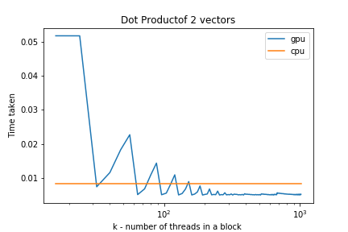
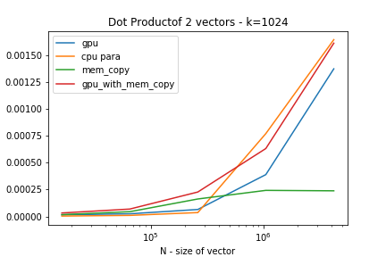
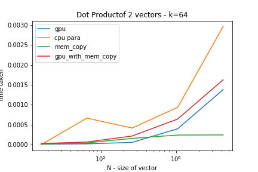
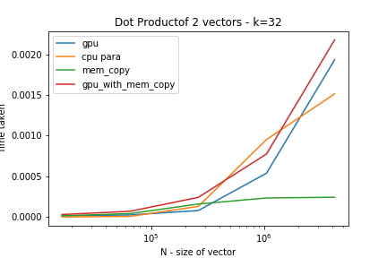
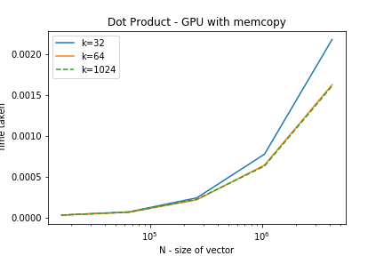
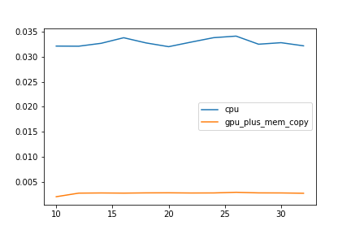
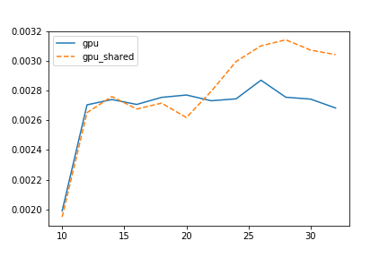
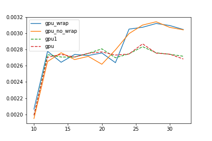
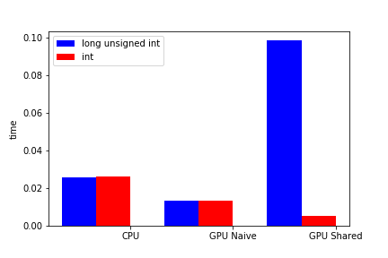

# TP3 : CUDA

Preparation :

1. Installation : `sudo apt install nvidia-cuda-toolkit`
2. Reboot

How to use GPU

1. Import the necessary headers

```C
#include "cuda_runtime.h"
#include "cuda.h"
```

2. The gpu need access to the data that is will manipulate. We would need to create 2 variables. One for the host and one for the device. By convention, we can name the variables used specifically by Cuda : `d_var`. Just like we need to initalize the vectors in C, we need to intialize them in the gpu device with `cudaMalloc`.

```
cudaMalloc(<address of var>, <sizeof of variable>);
```

3. So as for the gpu device to have the necessary data, it needs to be copied over. Similarily, when the gpu finishes its execution, we would need to copy the resultat back to the host device. The function we would need is `cudaMemcpy`. The signature of the function is available here : `http://horacio9573.no-ip.org/cuda/group__CUDART__MEMORY_g48efa06b81cc031b2aa6fdc2e9930741.html`

- Example:

```C
cudaMemcpy(d_Source, Source[0], height*width*sizeof(u_char), cudaMemcpyHostToDevice);

cudaMemcpy(ResultatGPU[0], d_ResultatGPU, height*width*sizeof(u_char), cudaMemcpyDeviceToHost);
```

4. Writing the gpu function This function is called within a thread that is contained within a block. We have access to `blockIdx`, `blockDim` and `threadIdx`.
   In order to have each thread execute an action, we need a unique id for each thread.
   For eaxmple :

   ```C
   int threadId = blockId.x * blockDim.x + threadIdx.x;
   ```

   `blockId` is the id of the block
   `blockDim` is the size of the block
   `threadId` is the id of the thread within the block.

   The above equations gives us a global id of each thread.

   N.B. the gpu function needs to be sepcified as `__global__` for it be called.

5. Finally, you can now call the gpu function that executes the code in the gpu. We need to specify the size of the blocks and the number of threads in each block.
   ```C
   gpu_function<<<no-of-blocks, no-threads-per-block>>>(arguments);
   ```
6. Do not forget : `cudaDeviceSynchronize();` This is blocking until the device has completed all preceding requested tasks. It also allows us to know if one of the preceding tasks has failed.

### Dot product

Naive gpu code :

```C
__global__ void gpu_saxpy(int n, float *x, float *y, float* s)
{
    int i = blockIdx.x*blockDim.x + threadIdx.x;
    if (i < n)
    atomicAdd(s, x[i] * y[i]);

}
```

Within each block, each thread will execute the multiplication and will need to add the result to the shared sum `s`. Because `s` is shared across of all threads, we need to use `atomicAdd` to ensure there is no simultaneous read / writes.

This line `if (i < n)` is _important_ to ensure that the code does not try to access memory outside of the boundsof its vector. This usually does not happen when the size of the blocks & number of threads are correctly dimensioned. However, it is generally a good idea to have 1 more block then necessary to ensure that all parts of the input vector is taken into account.

#### Time results


The gpu results increases when we increase the number of threads within a block. From over 100 threads per block, gpu performs better than cpu.

It is expected that there will not be a huge gain in performance with the gpu as `atomicAdd` forces.

Let's take a look at the difference in performance when we vary the size of the vector:






Notes:

- `k` is the number of threads in each block.

Observations :

- When we take into consideration the time taken for the gpu memcopy, the gpu performance does not exceed a parallelized cpu performance.
- The cpu performance various suspiciously when k changes. This might be due to the fact that the computer is not solely executing this program but it has various other programs running in the background.
- Surpisingly, the gpu time for `k=1024` is not faster than `k=64` as shown in the first graph. It may be that `k=64` represnts a local minimum spike in the first graph.

### Sobel Filter on an image

The principal of the Sobel filter is to apply a function to a small section of the image to create a new point


When working with an image, we need to take into account the fact that is the 2 dimensional. Therefore, we need to allocate width\*height memory. If we can allocate this array of memory in a contiguous manner, we can simply the 2D array into a vector and operate upon it as before using only one dimension of the blocks & threads in the GPU.

We can also work in two dimensions within the GPU which is what is used below.

**Naive GPU Code**

We assign each pixel of the image to a thread. Given that we that each 2D block has a size of `BLOCKDIM_X` \* `BLOCKDIM_Y`, we would need at most `width/BLOCKDIM_X + 1` blocks on the along the width and `height/BLOCKDIM_Y + 1` along the height of the image.

1 pixel = 1 thread means that the number of threads within a block is equals to `BLOCKDIM_X` \* `BLOCKDIM_Y`

```C
dim3 threads(BLOCKDIM_X,BLOCKDIM_Y);
dim3 blocks(width/BLOCKDIM_X + 1, height/BLOCKDIM_Y + 1);
```

Like previously, we need to ensure that we are not going out of bounds. Given an image of size `n*m`, the dimension of the filter being 3, the new image will be of size `(n-1)*(m-1)`.

```C
if ((i==0)||(i>=height-1)||(j==0)||(j>=width-1)) {Resultat[globalIndex]=0;}
```

This sets the outer edges of the image to black.

```C
val  = std::abs(Source[(i-1)*width+(j-1)] + Source[(i-1)*width+(j)] + Source[(i-1)*width+(j+1)] -\
                (Source[(i+1)*width+(j-1)] + Source[(i+1)*width+(j)] + Source[(i+1)*width+(j+1)]));
Resultat[globalIndex]  = val + std::abs(Source[(i-1)*width+(j-1)] + Source[(i)*width+(j-1)] + Source[(i+1)*width+(j-1)] -\
                                        (Source[(i-1)*width+(j+1)] + Source[(i)*width+(j+1)] + Source[(i+1)*width+(j+1)]));
```

This calculates the sobel filter for each pixels and set the result at the right place in the `Resultat` array.

**Shared GPU Code**
We can also use the shared function of the gpu to share part of the image of the size `BLOCKDIM_X` \* `BLOCKDIM_Y`.

```C
__shared__ u_char tuile[BLOCKDIM_X][BLOCKDIM_Y];
```

This changes the total number of blocks needed because the filters are supposed to overlap when they calculate the value of a pixel. In this case, we have a filter of size 3\*3

```C
dim3 blocks2(width/(BLOCKDIM_X-2),height/(BLOCKDIM_Y-2));
```

### Transpose an image

In order not to worry about segfault and thinking too hard, transposing a square image is chosen. The principle is the same for a rectangular image.

Naively, we read each pixel line by line and then write to the appropriate place in the new image array.

Naive gpu code

```C
int j = blockIdx.x*blockDim.x + threadIdx.x;
int i = blockIdx.y*blockDim.y + threadIdx.y;
int globalIndex = i*width+j;
Resultat[j*height+i]  = Source[globalIndex];
```

**Premise :**
Let's take an exmaple of a 3 by 3 pixel image:

```
1 2 3
4 5 6
7 8 9
```

When flattened, we have `1 2 3 4 5 6 7 8 9`.

Whenever a thread on a gpu reads or writes to global memory, it always accesses a large chunk of memory at once. This happened even if it only needs a part of the data that is it accessing.
For example :
Thread 1 needs `1`, GPU reads a size 3 chunk `1 2 3`.

Now, if other threads requires to read data in the same chunk, the GPU does not need access global memory to retrieve the data. It can use the same chunk.
For example :
Thread 2 and Thread 3 want `2` and `3` respectively, the GPU would not need another access to global memory as we already have the `1 2 3` chunk.

Consequently, the GPU is most efficient when threads read or write contiguous memory locations. Here, transposing the matrix naively is not exploiting this possible efficiency by using coalescence.

The transposed matrix is

```
1 4 7
2 5 8
3 6 9
```

When flattened, we have `1 4 7 2 5 8 3 6 9`.

When writing to the result vector, it is **not** done in a contiguous manner. Using the previous example of accessing global memory by chunks of 3, we need 3 accesses to write `1`, `2` and `3` into the results vector. (first: `1 4 7`, second: `2 5 8` and third: `3 6 9`). This is the least optimal configuration.

We can use the ability to shared a chunk of global memory within each thread to make the reads and writes coalescent.

Shared gpu code

```C
__shared__ u_char tuile[BLOCKDIM_X][BLOCKDIM_Y+1];

int x = threadIdx.x;
int y = threadIdx.y;
int i = blockIdx.y*BLOCKDIM_Y + y;
int j = blockIdx.x*BLOCKDIM_X + x;

//mainstream
tuile[x][y] = Source[i*width+j];
__syncthreads();

Resultat[j*height+i]  = tuile[x][y];
```

We share a block of the image with all the threads, thus requiring 1 read access. Then we need to write to the shared block a local transpose. Then we can copy the locally transposed block in a coalescent manner to the resultat vector.

**Results**



By just using the GPU, we can improve our performance radically.


However, there is not distinct improvement between using the gpu naively and trying to optimize with the use of coalescent operations.



Another possible optimisation : padding the shared block to avoid always using the same memory band. There is no remarkable improvement.

### Histogram of a gray image

Input: A grayscale image represented by integers between 0 and 255.
Output: An array of length 256. A[i] = number of pixels of color `i`.

**Naive gpu code**

```C
int j = blockIdx.x*blockDim.x + threadIdx.x;
int i = blockIdx.y*blockDim.y + threadIdx.y;
int globalIndex = i*width+j;
atomicAdd(&Resultat[Source[globalIndex]], 1);
```

Each thread may contain the same shade of grey. It would mean that they may access the `Resultat` array simultaneously to increment the count. Therefore we must use atomic add.

This is not the most optimal way to compute the historgram of an image as it would be about as slow as using the cpu if the entire image is of the same color. This is because there will a lot of waiting with atomic add to the place in the array.

This issue can be solved by using the possiblity of sharing a block with a group of threads. This would imply that the maximum amount of waiting would be the number of pixels within that block. We would compute locally the histogram of each block in a local result vector. When all the threads have completed within this block (done with a `__syncthreads();`), we can add the local results to the global results vector with an `atomicAdd`.

One way of approaching this is to have the block to be of a fixed size (16\*16) to ensure that there are 256 threads in a block and each thread takes care of one color of pixel.

**Shared gpu code**

```C
// size of block fixed to be 16 * 16 = 256
__shared__ unsigned int resultat_local[256];

int x = threadIdx.x;
int y = threadIdx.y;
int i = blockIdx.y*BLOCKDIM_Y + y;
int j = blockIdx.x*BLOCKDIM_X + x;
int globalIndex = i*width+j;
int localIndex = x*BLOCKDIM_X + y;

if (localIndex <= 255)
    resultat_local[localIndex] = 0;

__syncthreads();

if (i < height && j < width)
    atomicAdd(&resultat_local[Source[globalIndex]], 1);

// wait for all threads in block to finish
__syncthreads();

// Place local resultat into global array
// 256 threads dans un block
if (localIndex <= 255)
    atomicAdd(&Resultat[localIndex], resultat_local[localIndex]);
```



We can see that by sharing a block, the performance is a lot faster than naively using the gpu. However, if the size of the shared block to too large as showed by using the `unsigned long int`, it is a lot slower.
